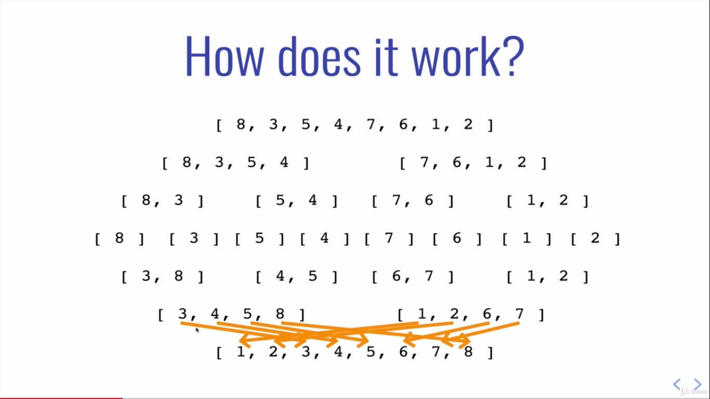
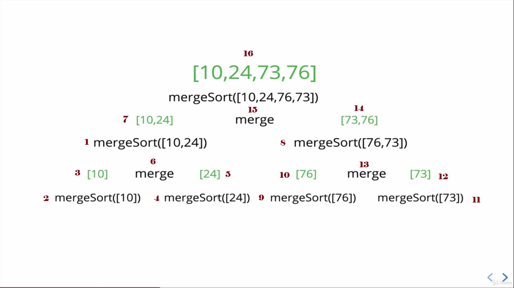

# Data Structure & Algorithm

# 07_04 Merge Sort

* It's a combination of three things - spliting, merging and sorting!
* Exploits the fact that arrays of 0 or 1 element are always sorted
* Works by decomposing an array into smaller arrays of 0 or 1 elements, then building up a newly sorted array

## How does it work?

## Merging Arrays
* In order to implement merge sort, it's useful to first implement a function responsible for merging two sorted arrays
* Given two arrays which are sorted, this helper function should created a new array which is also sorted, and consists of all of the elements in the two input arrays
* This function should run in **O(n + m)** time and **O(n + m)** space and **should not** modify the parameters passed to it

## Merging Arrays Pseudocode
* Create an empty array, take a look at the smallest values in each input array
* While there are still values we haven't looked at...
  * If the value in the first array is smaller than the value in the second array, push the value in the first array into our results and move on to the next value in the first array
  * If the value in the first array is larger than the value in the second array, push the value in the second array into our results and move on to the next value in the second array

## Merge Sort Pseudocode
* Break up the array into halves until you have arrays that are empty or have one element
* Once you have smaller sorted arrays, merge those arrays with other sorted arrays untill you are back at the full length of the array
* Once the array has been merged back together, return the merged (and sorted!) array

## Merge Sort Process

## Big O of Merge Sort

Best        | Average    | Worst      | Space Complexity
--------------------------------------------------------
O(n log n)  | O(n log n) | O(n log n) | O(n)