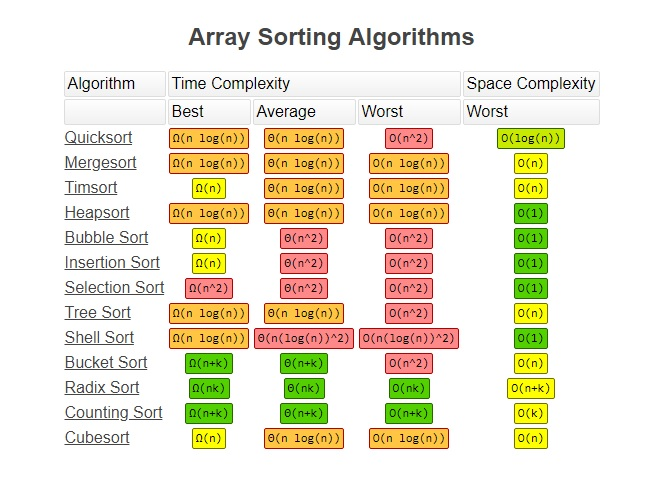

# Data Structure & Algorithm

# 01 Big O Notation
- determines which one is best from multiple implemenations of the same function
- describes how runtime depends on inputs

## Who Cares?
* When our code slows down or crashes, identifying parts of the code that are inefficient can help us find pain points in our applications

## What does better mean?
* Faster
* Less memory-intensive
* More readable

## Time Complexity:
```
- analyze the runtime as the size of the inputs increases
```

## Time Complexity Shorthands:
1. Arithmetic operations are constant.
2. Variable assignment is constant.
3. Accessing elements in an arry (by index) or object (by key) is constant.
4. In a loop, the complexity is the length of the loop times.

## (Auxiliary) Space Complexity:
```
- how much additional memory do we need to allocate
```

## Space Complexity Shorhands:
1. Most primitives (booleans, numbers, undefined, null) are constant space.
2. Strings require O(n) space (where n is the string length)
3. Reference types are generally O(n), where n is the length (for arrays) or the number of keys (for objects)

## Big O Complexity Chart


## Common Data Structure Operations


## Array Sorting Algorithms

